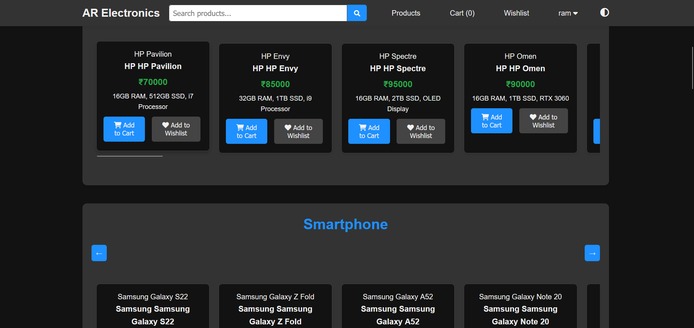

# 🛒 Online Marketplace – Empowering Local Businesses Online

**Online Marketplace** is a feature-rich online marketplace built using **Flask (Python)**, designed to empower local businesses with a digital storefront. It connects local sellers with customers through a user-friendly web interface and provides essential tools for managing products, carts, discounts, and purchases.

---

## 🚀 Features

- 🔐 User Authentication (Login/Signup)
- 🛍️ Digital Storefronts for Local Sellers
- 🛒 Add to Cart & View Cart Functionality
- 📦 Purchased Products Tracking
- 💰 Discount Offers and Promotions
- 🎨 Modern & Responsive UI using HTML/CSS/JS
- 🧾 Order History for Customers
- ⚙️ Flask-based Backend with Routing & Session Handling

---

## 📸 Screenshots

### 🏠 Homepage  
([ar_electronics/assets/Screenshot 2025-06-02 184246.png](https://github.com/Rameshwarbhagwat/Online-marketplace/blob/main/ar_electronics/assets/Screenshot%202025-06-02%20184057.png))

### 🏠 Login view 
([ar_electronics/assets/Screenshot 2025-06-02 184216.png](https://github.com/Rameshwarbhagwat/Online-marketplace/blob/main/ar_electronics/assets/Screenshot%202025-06-02%20184216.png))

### 🏠 Products View 
([ar_electronics/assets/Screenshot 2025-06-02 184340.png](https://github.com/Rameshwarbhagwat/Online-marketplace/blob/main/ar_electronics/assets/Screenshot%202025-06-02%20184320.png))

### 🛒 Wishlist View 
)

### 🧑‍💼 Seller Dashboard  


> All images are stored in the `assets/` folder. Replace filenames as per your actual files.

---

## 🛠️ Tech Stack

| Layer       | Technology       |
|-------------|------------------|
| Frontend    | HTML, CSS, JavaScript |
| Backend     | Python (Flask Framework) |
| Database    | SQLite / MySQL |
| Styling     | Bootstrap (optional) |
| Versioning  | Git & GitHub |

---

## 📁 Project Structure

```bash
ar_electronics/
├── static/               # CSS, JS, Images
├── templates/            # HTML templates (Jinja2)
├── app.py                # Main Flask application           
├── data/                 # json file
├── assets/               # Screenshots for README
├── README.md
├── work.txt
└── instance              # database
